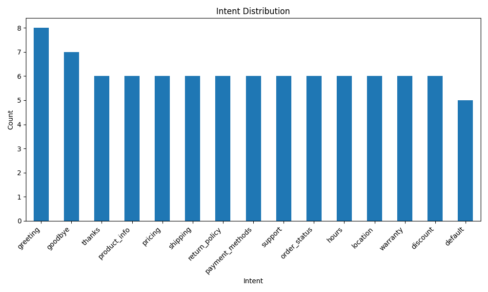

# Task 2: AI Chatbot & NLP System - Customer Service Chatbot

## Overview
This project implements an intelligent customer service chatbot capable of understanding user queries and providing relevant responses using NLP techniques. It includes text preprocessing, intent classification using TF-IDF and machine learning, and a FastAPI backend with a web interface.

## Technologies Used
- Python
- FastAPI
- NLTK
- SpaCy
- Scikit-learn
- TF-IDF Vectorization
- Random Forest / SVM / Naive Bayes Classifiers
- HTML/CSS/JavaScript

## Project Structure
```
task2/
├── data/
│   ├── intents.json              # Training dataset with intents and responses
│   └── processed_data.json      # Preprocessed data
├── models/
│   ├── tfidf_vectorizer.pkl      # Trained TF-IDF vectorizer
│   ├── intent_classifier.pkl    # Trained intent classifier
│   ├── model_metadata.json      # Model metadata
│   └── intents.json              # Intents for response generation
├── create_dataset.py             # Dataset creation script
├── preprocessing.py              # Text preprocessing
├── train_nlp.py                  # NLP model training
├── chatbot_engine.py             # Chatbot engine
├── main.py                       # FastAPI application
├── web_interface.html           # Web chat interface
├── requirements.txt              # Python dependencies
└── README.md                     # This file
```

## Installation

1. Create a virtual environment:
```bash
python -m venv venv
venv\Scripts\activate  # On Windows
source venv/bin/activate  # On Linux/Mac
```

2. Install dependencies:
```bash
pip install -r requirements.txt
```

3. Download spaCy model (optional, for advanced NLP):
```bash
python -m spacy download en_core_web_sm
```

## Usage

### Step 1: Create Dataset
```bash
python create_dataset.py
```
This creates a customer service dataset with 15 different intents.

### Step 2: Preprocess Data
```bash
python preprocessing.py
```
This performs text cleaning, tokenization, and lemmatization.

### Step 3: Train NLP Model
```bash
python train_nlp.py
```
This trains the intent classifier using TF-IDF vectorization and compares multiple classifiers (Random Forest, SVM, Naive Bayes).

### Step 4: Start FastAPI Server
```bash
python main.py
```
The API will be available at `http://localhost:8000`

### Step 5: Use Web Interface
Open `web_interface.html` in your browser to interact with the chatbot.

## API Endpoints

### POST /chat
Send a message to the chatbot.

**Request:**
```json
{
  "message": "What are your business hours?",
  "user_id": "optional_user_id"
}
```

**Response:**
```json
{
  "intent": "hours",
  "confidence": 0.95,
  "response": "We're open Monday to Friday, 9 AM to 6 PM, and Saturday 10 AM to 4 PM.",
  "user_id": "optional_user_id"
}
```

### GET /intents
Get all available intents.

**Response:**
```json
{
  "intents": ["greeting", "goodbye", "thanks", "product_info", ...],
  "count": 15
}
```

### GET /health
Health check endpoint.

## Analysis Plots




## Methodology

### Text Preprocessing
- Text cleaning (lowercase, remove special characters)
- Tokenization using NLTK
- Lemmatization using WordNetLemmatizer
- Stop word removal

### Feature Extraction
- TF-IDF (Term Frequency-Inverse Document Frequency) vectorization
- N-gram features (unigrams and bigrams)
- Maximum 1000 features
- Stop word filtering

### Model Training
Trained and compared 3 classifiers:
1. Random Forest Classifier
2. Support Vector Machine (SVM)
3. Naive Bayes

The best performing model is automatically selected and saved.

### Intent Classification
- TF-IDF transforms input text to feature vectors
- Classifier predicts intent category
- Confidence score calculated using predict_proba

### Response Generation
- Random response selection from predefined responses for each intent
- Fallback response for unknown intents

## Supported Intents
The chatbot supports 15 different intents:
- greeting
- goodbye
- thanks
- product_info
- pricing
- shipping
- return_policy
- payment_methods
- support
- order_status
- hours
- location
- warranty
- discount
- default

## Features
- Intent classification with confidence scores
- Multiple response variations per intent
- RESTful API with FastAPI
- Interactive web interface
- Real-time chat with typing indicator
- CORS support for web integration

## Testing the Chatbot

### Command Line Interface
```bash
python chatbot_engine.py
```

### API Testing
```bash
curl -X POST "http://localhost:8000/chat" \
  -H "Content-Type: application/json" \
  -d '{"message": "Hi there!"}'
```

### Web Interface
Open `web_interface.html` in a web browser.

## Deployment

### Deploy to Vercel/Railway/Heroku
1. Create `requirements.txt`
2. Create `Procfile` (for Heroku): `web: uvicorn main:app --host 0.0.0.0 --port $PORT`
3. Push to GitHub
4. Connect to deployment platform
5. Deploy as a web service

### Environment Variables
- PORT: Server port (default: 8000)

## Future Enhancements
- Integration with LLMs (GPT, Claude) for more natural responses
- Conversation history and context awareness
- Voice input/output
- Multi-language support
- Semantic search with sentence transformers
- Retrieval-Augmented Generation (RAG)

## License
This project is created for the Invoqe AI/ML Internship Program.
